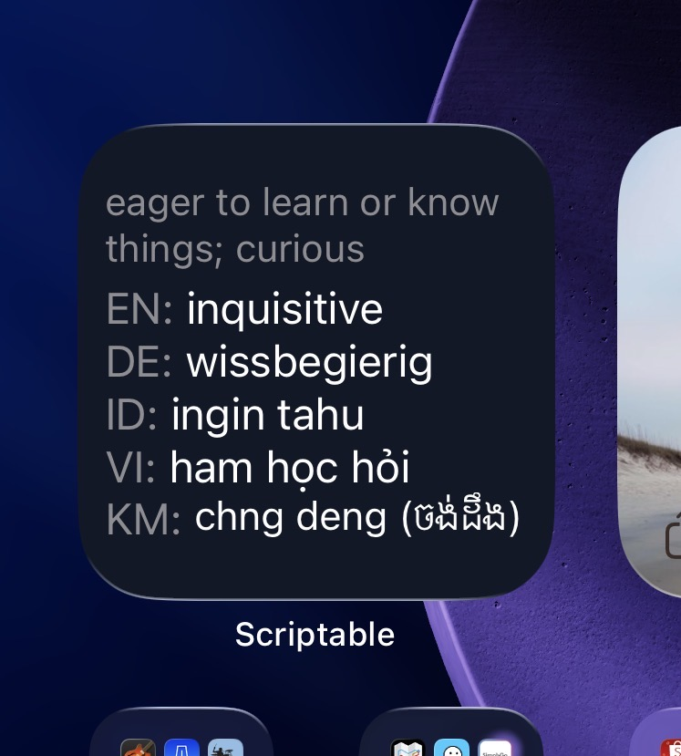
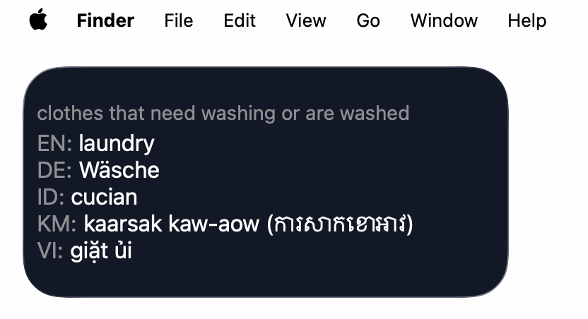

# Multilingual Word Widget - Scriptable

This project is a **personalizable vocabulary widget** for iOS and MacOS built with the [Scriptable](https://apps.apple.com/app/scriptable/id1405459188) app. It shows a random word in **multiple languages** as a widget on your **home/lock screen**.

The focus is on **daily passive exposure** to vocabulary across several languages at once.

<table>
   <tr>
      <td align="center">
         
         <br/>
         <strong>Home Screen (iOS)</strong>
      </td>
      <td align="center">
         
         <br/>
         <strong>Lock Screen (iOS)</strong>
      </td>
   </tr>
   <tr>
      <td colspan="2" align="center" style="padding-top:16px;">
         
         <br/>
         <strong>macOS Desktop</strong>
      </td>
   </tr>
</table>

---


## Main Version — Elastic Workflow

- Uses an [Elastic Workflow](https://www.elastic.co/docs/explore-analyze/workflows) for both word generation and translations
- Single API call replaces separate fetch + translate steps
- Centralized configuration via your Elastic agent/tool
- Includes per-device recent-cache, TTL and size controls

#### Customizations
- **Languages:** Edit the `LANG_CONFIG` array in `script_elastic.js` to enable languages for translation and display. Each entry is an object with `code`, `name` and `include` (set `include: true` to use a language).
- **Theme:** Edit the `THEME` variable in `script_elastic.js` to constrain generation (default: "anything").


#### Local Caching

- A local file is stored in `FileManager.documentsDirectory()` as `recent_words.json` to reduce showing the same word repeatedly. The path can be console logged by Scriptable. 
- Adjust `RECENT_TTL_MS` and `RECENT_MAX` to control how recently-seen words are filtered.


### Usage

1. Set up Elastic Agent Builder tool with your word generation workflow
2. Copy `script_elastic.js` (root of repo) to Scriptable
3. Configure credentials (one-time — run inside Scriptable):

```javascript
// One-time: run inside Scriptable to store keys in the system Keychain
Keychain.set("ELASTIC_API_URL", "https://your-elasticsearch-endpoint/...");
Keychain.set("ELASTIC_API_KEY", "base64_api_key_here");
Keychain.set("ELASTIC_TOOL_ID", "word.of.the.day.multilingual");
```

4. Add widget


## Alternatives

If you prefer a simpler local or public-API approach, two alternatives are available in the `scripts/` folder.

### Static Vocabulary List 
- Self-contained vocabulary entries defined in the script
- No internet connection required
- Perfect for curated or personal word lists
- Easy to customize and add your own words

#### Usage
1. Copy `scripts/script_static.js` to Scriptable
1. Customize the `entries` array with your vocabulary and set `LANGS`

### Dynamic with Public APIs
- Fetches random words from a public random word API
- Translates words using a public translation API (LibreTranslate or similar)
- BUT multilingual support is limited

#### Usage
1. Copy `scripts/script_api.js` to Scriptable
1. Configure the top-level constants (`USER_LANGUAGE_CODES`, `WORDS_TO_FETCH`, etc.)
