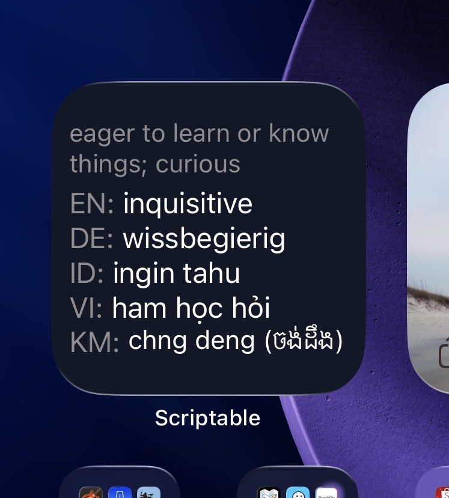
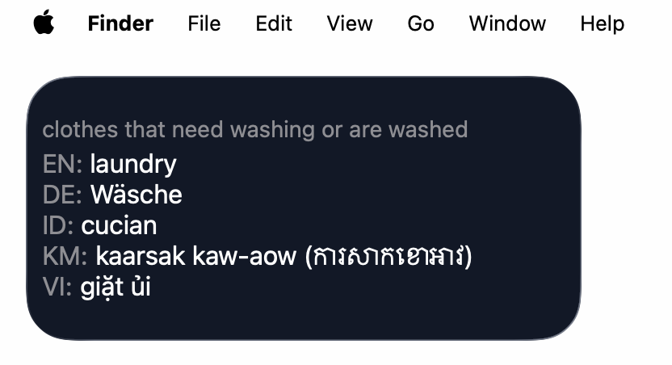

# Multilingual Word Widget - Scriptable

This project is a **personalizable vocabulary widget** for iOS and MacOS built with the [Scriptable](https://apps.apple.com/app/scriptable/id1405459188) app. It shows a random word in **multiple languages** as a widget on your **home/lock screen**.

The focus is on **daily passive exposure** to vocabulary across several languages at once.

Read about the journey on [Substack](https://allardqjy.substack.com/p/nano-learning-for-polyglots-with?r=6xcuuz) or [Medium](https://medium.com/@allardqjy/413fd19a2f59).

<table>
   <tr>
      <td align="center">
         
         <br/>
         <strong>Home Screen (iOS)</strong>
      </td>
      <td align="center">
         
         <br/>
         <strong>Lock Screen (iOS)</strong>
      </td>
   </tr>
   <tr>
      <td colspan="2" align="center" style="padding-top:16px;">
         
         <br/>
         <strong>macOS Desktop</strong>
      </td>
   </tr>
</table>

---

## Getting Started (Recommended)

**Direct LLM API calls with intelligent batching** — Free, optimized, and modern approach using Google Gemini or OpenAI.

### Why Use This Version?
- 💰 **Nearly Free:** ~2 API calls/month with Gemini's free tier (vs ~100+ calls with other approaches)
- 🔋 **Offline Resilient:** 50-word cache means widget works even without internet
- ⚡ **Fast & Stable:** Words rotate at fixed intervals, no flickering on refresh
- 🎯 **Simple Setup:** Just an API key, no infrastructure needed
- 🌍 **High Quality:** Excellent translations across 20+ languages

### Key Features
- **Batch Mode:** Fetches 50 words in one API call, rotates through them over time (~2 calls/month vs ~100)
- **Smart Rotation:** Configurable word rotation interval (5 minutes for testing, 1 hour for production)
- **TTL-based Deduplication:** Remembers words for 24 hours to prevent repetition
- **Theme Change Detection:** Immediate cache clear when theme changes
- **Robust Error Handling:** Graceful fallbacks with user-friendly error messages
- **Offline Resilient:** Operates with cached words when API unavailable
- **Provider Flexibility:** Easy switching between Gemini (free) and OpenAI

### Architecture Highlights
- Pre-fetches words in batches, stores locally in `word_cache.json`
- Rotates to new word at configured interval, stable across widget refreshes
- Automatically refetches when cache runs low (< 10 words remaining)
- Tracks display history with timestamps for intelligent deduplication
- Clears cache immediately when `THEME` constant changes

📖 **[Read detailed technical documentation](docs/llm-batch-mode.md)** for architecture, configuration, and troubleshooting.

### Customizations
- **Languages:** Edit the `LANG_CONFIG` array in `script_llm.js` (same as Elastic version)
- **Theme:** Edit the `THEME` variable in `script_llm.js` (default: "anything")
- **Rotation Interval:** Change `WORD_ROTATION_INTERVAL` (5 min testing, 60 min production)
- **Batch Size:** Adjust `BATCH_SIZE` (default: 50 words per API call)
- **Provider:** Change `ACTIVE_PROVIDER` to switch between `"gemini"` or `"openai"`
- **Model:** Edit `PROVIDER_CONFIG` to use different models

### Setup

**Option 1: Use the setup helper script (recommended)**

1. Copy `setup_keychain.js` to Scriptable
2. Run it once in Scriptable
3. Select "Gemini API Key" (or "OpenAI API Key")
4. Paste your API key from [Google AI Studio](https://aistudio.google.com/apikey)
5. Copy `script_llm.js` to Scriptable and add widget

**Option 2: Manual Keychain setup**

Run this code once inside Scriptable to store your API key:

```javascript
// One-time: run inside Scriptable to store key in system Keychain
Keychain.set("GEMINI_API_KEY", "your-gemini-api-key-here");
// Or for OpenAI:
// Keychain.set("OPENAI_API_KEY", "your-openai-api-key-here");
```

**For Node.js testing:**
```bash
export GEMINI_API_KEY="your-key-here"
node script_llm.js
```

### Why Gemini 3.1 Flash-Lite Preview?
- ✅ **Free tier** - No usage limits, perfect for batch mode (~2 calls/month)
- ✅ **Translation-optimized** - Specifically designed for translation tasks
- ✅ **High-quality output** - Excellent translation accuracy across 20+ languages
- ✅ **Latest generation** - Gemini 3.1 (newest available)
- ✅ **Fast response time** - Optimized for quick API responses

---

## Alternative: Elastic Workflow

For teams with existing Elastic infrastructure, an **Elastic Workflow integration** is available. This approach centralizes word generation and translation logic in your Elastic stack.

**Key difference:** Single API call per widget refresh (~100-720/month) vs batch mode (~2/month).

**Best for:**
- Organizations already using Elastic
- Teams needing centralized configuration
- Use cases requiring Elastic observability features

📖 **[Full Elastic Workflow documentation](docs/elastic-workflow.md)** — Setup, configuration, and comparison guide.

**Quick Start:**
1. Set up Elastic Agent Builder workflow (word generation + translations)
2. Copy `script_elastic.js` to Scriptable
3. Configure via Keychain: `ELASTIC_API_URL`, `ELASTIC_API_KEY`, `ELASTIC_TOOL_ID`
4. Add widget

---

## Other Alternatives

If you prefer a simpler local or public-API approach, two alternatives are available in the `scripts/` folder.

### 1. Static Vocabulary List 
- Self-contained vocabulary entries defined in the script
- No internet connection required
- Perfect for curated or personal word lists
- Easy to customize and add your own words

#### Usage
1. Copy `scripts/script_static.js` to Scriptable
1. Customize the `entries` array with your vocabulary and set `LANGS`

### 2. Dynamic with Public APIs
- Fetches random words from a public random word API
- Translates words using a public translation API (LibreTranslate or similar)
- BUT multilingual support is limited

#### Usage
1. Copy `scripts/script_api.js` to Scriptable
1. Configure the top-level constants (`USER_LANGUAGE_CODES`, `WORDS_TO_FETCH`, etc.)

---

## Backend API (v1 Minimal)

A minimal backend implementation is available in [backend/](backend/) for multi-user support without a database.

### Highlights
- Anonymous `POST /api/word` endpoint
- Provider abstraction (`gemini` or `openai`)
- Basic request validation and timeout handling
- Simple per-IP or `x-client-id` in-memory rate limiting

### Quick Start
```bash
cd backend
cp .env.example .env
pnpm install
export $(grep -v '^#' .env | xargs)
pnpm start
```

See [docs/backend-v1.md](docs/backend-v1.md) for API contract and deployment notes.

If you prefer Bun:
```bash
cd backend
cp .env.example .env
bun install
export $(grep -v '^#' .env | xargs)
bun run start
```
